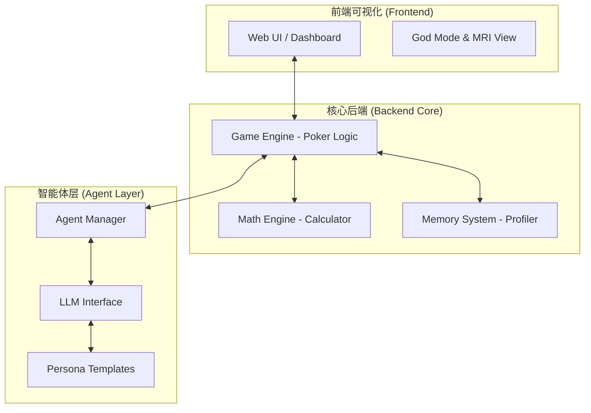
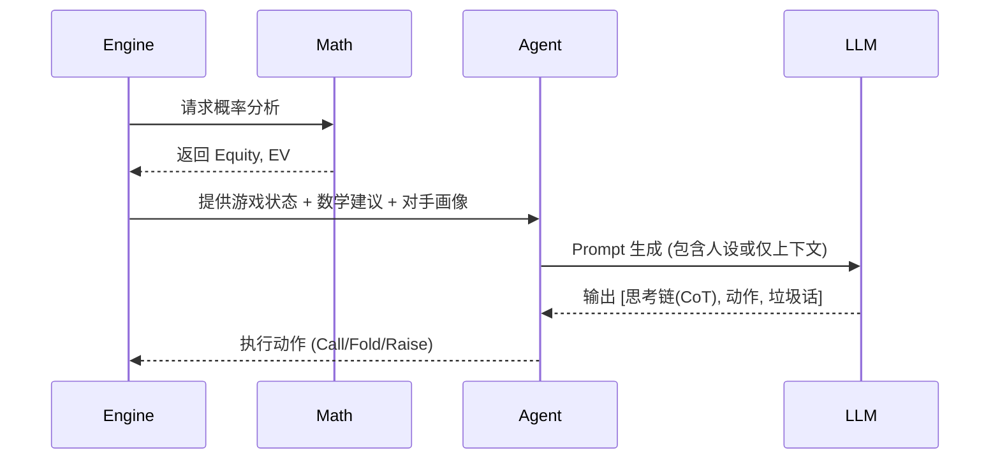

# Project BluffNet Technical Architecture

## 1. 总体架构 (High-Level Architecture)

Project BluffNet 采用 **分层解耦架构**，确保博弈逻辑、决策智能与视觉呈现层级清晰。系统核心围绕“双脑架构”构建，即“理智脑”（数学引擎）与“性格脑”（LLM 智能体）。



---

## 2. 后端核心 (Backend Core)

### 2.1 游戏引擎 (Poker Engine)
- **职责**: 负责维护全局对局状态（POTS, Chips, Positions, Blinds）、规则校验（Betting sequence, Fold/Call/Raise validation）以及发牌逻辑。
- **技术栈**: 基于 Python，集成 `treys` 或 `poker` 库进行牌型评估。
- **状态树**: 输出结构化的 JSON 状态，供智能体交互与前端渲染。

### 2.2 理智脑 (Math Brain)
- **职责**: 为当前手牌提供绝对客观的统计学支持。
- **关键指标**:
    - **Equity (胜率)**: 当前底牌与公共牌在数学意义上的胜率期望。
    - **Pot Odds (底池赔率)**: 回报与风险的比率。
    - **EV (Expected Value)**: 结合决策动作的收益预期。
- **作用**: 将数学数据输入 LLM，作为决策基础（Raw Data），但不直接决定动作。

---

## 3. 智能体系统 (Agent Framework)

系统支持两种模式，以灵活应对“人设驱动”与“纯博弈驱动”的需求。

### 3.1 模式 A：人设驱动型 (Persona-Driven)
- **核心逻辑**: LLM 充当“演员”，在数学建议的基础上，结合人设（Persona）进行非理性决策或心理战。
- **系统提示词 (System Prompt)**: 
    - **人格角色**: 例如“贪婪的资本家”、“胆小的数学老师”。
    - **表达风格**: 决定垃圾话（Table Talk）的内容。
    - **风险偏好**: 设定其对 EV 的偏离程度。
- **场景**: 适合社会学实验、娱乐对抗。

### 3.2 模式 B：纯上下文导向型 (Context-Only)
- **核心逻辑**: 去除显式人设，LLM 专注于**博弈演化**。
- **决策输入**: 仅包含历史对局记录、筹码波动、对手近期动作频率。
- **特点**: AI 没有固定的性格，其表现完全由其学习（In-context Learning）到的对手行为调整。
- **场景**: 适合高性能竞技、战术反制研究。

### 3.3 决策工作流 (Decision Workflow)


---

## 4. 记忆与画像系统 (Memory System)

为了让 AI 具备“长记性”，系统分为多级记忆存储：

- **短期记忆 (Context)**: 存储当前手牌的 Action Sequence。用于 LLM 的 Context Window。
- **长期画像 (Persistent Profile)**: 
    - 记录对手的历史标签（例如：VPIP 极高的人，诈唬频率 20%）。
    - 存储对手在特定情况下的反应（例如：被 3-Bet 后的 Fold 率）。
- **更新机制**: 每手牌结束后由一个小型的 LLM Agent 或规则引擎自动总结并更新数据库（Vector DB or SQL）。

---

## 5. 接口与通讯 (Communication)

### 5.1 数据协议
统一采用 JSON 协议，确保前端、引擎与智能体之间的语言无关性。
```json
{
  "event": "ACTION_REQUEST",
  "game_state": { "pots": 1200, "stage": "FLOP", "community": ["As", "Kd", "2c"] },
  "math_advice": { "equity": 0.45, "pot_odds": 2.5 },
  "profiles": { "player_A": { "style": "Aggressive", "last_bluff": true } }
}
```

## 5. 仪表盘与可视化 (Dashboard & Visualization)

前端不仅是游戏界面，更是通过 **UI/UX** 呈现数据洞察的核心工作台。

### 5.1 实时监控 (Real-time Monitor)
- **桌面信息**: 实时显示公共牌 (Community Cards)、底池金额 (Pot Size) 以及各玩家筹码量。
- **状态指示器**: 清晰展示当前行动者 (Active Player) 及倒计时，确保博弈节奏可视化。

### 5.2 上帝视角 (God Mode)
- **功能**: 管理员可一键开启“透视模式”。
- **效果**: 所有 AI 的暗牌 (Hole Cards) 翻转可见，并显示当前的实时胜率 (Equity)。
- **用途**: 用于验证 AI 是否在进行“诈唬”或“价值下注”。

### 5.3 脑部核磁 (Brain MRI)
- **功能**: 鼠标悬停在 AI 头像上时，浮层显示其决策的内部逻辑。
- **数据源**: LLM 的 `CoT` (Chain of Thought) 输出。
- **展示内容**:
    - **对局势的判断**: "对手可能持有同花顺面..."
    - **决策依据**: "胜率仅 15%，但赔率合适，且对手打得太紧。"
    - **情绪/人设**: "我是疯狂的赌徒，这把我要 All-in 吓死他！"

### 5.4 历史与日志 (History & Logs)
- **侧边栏日志**: 文本化记录每一手牌的关键动作 (Check/Call/Raise/Fold)。
- **对局回放 (Replay)**: (规划中) 支持进度条拖动，复盘整局博弈过程，便于分析“蝴蝶效应”。

---

## 6. 接口与通讯 (Communication)

### 6.1 数据协议
统一采用 JSON 协议，确保前端、引擎与智能体之间的语言无关性。
```json
{
  "event": "ACTION_REQUEST",
  "game_state": { "pots": 1200, "stage": "FLOP", "community": ["As", "Kd", "2c"] },
  "math_advice": { "equity": 0.45, "pot_odds": 2.5 },
  "profiles": { "player_A": { "style": "Aggressive", "last_bluff": true } }
}
```

---

## 7. 技术路线与选型 (Tech Stack)

- **语言**: Python 3.11+
- **模型支持**: OpenAI API, DeepSeek API, local Ollama (Llama 3/Qwen2.5)
- **数据库**: SQLite (轻量存储) + Redis (实时状态)
- **通信**: FastAPI + WebSockets (实时推送)
- **前端**: React/Vue3 + TailwindCSS + Lukewarm/Three.js (轻量卡牌交互)
