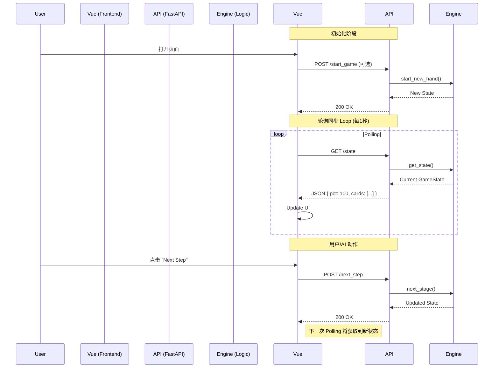

# 前后端交互文档 (Frontend-Backend Interaction)

本文档详细描述了 **Project BluffNet** 中，Vue 前端与 Python FastAPI 后端之间的数据交互机制与通信流程。

## 1. 架构概览 (Architecture Overview)

系统采用 **Client-Server 架构**，通过 HTTP JSON API 进行通信。

- **Frontend**: 纯展示层 (View)。负责渲染状态、发送用户指令。不包含任何游戏核心逻辑。
- **Backend**: 逻辑核心 (Model/Controller)。负责维护游戏状态 (GameState)、执行扑克规则、驱动 AI 决策。

## 2. 通信模式：短轮询 (Short Polling)

为了简化实现并保证实时性，前端采用 **短轮询** 机制同步状态。

- **频率**: 每 `1000ms` (1秒) 请求一次。
- **端点**: `GET /state`

**Frontend Implementation (`App.vue`)**:
```typescript
const fetchState = async () => {
    const res = await fetch('http://localhost:8000/state')
    const data: GameState = await res.json()
    gameState.value = data
}

onMounted(() => {
    fetchState()
    // Poll every 1 second
    pollInterval = window.setInterval(fetchState, 1000)
})
```

## 3. 数据流 (Data Flow)

### 3.1 状态同步流程

1.  **Backend**: `Engine` 计算当前牌局状态，生成 `GameState` 对象。
2.  **API**: `FastAPI` 将 `GameState` 序列化为 JSON。
3.  **Frontend**: `App.vue` 中的 `fetchState()` 获取 JSON。
4.  **Mapper**: 前端将 JSON 映射为 TypeScript 接口 (`types.ts`)。
5.  **Render**: Vue 响应式系统自动更新 UI (卡牌、筹码、底池)。

### 3.2 数据结构映射

#### Backend (`models.py`)
```python
class GameState(BaseModel):
    stage: GameStage
    pot_size: int
    community_cards: List[Card]
    current_player_idx: int
    players: List[Player]
    winners: List[int] = []
```

#### Frontend (`types.ts`)
```typescript
export interface GameState {
    stage: string
    pot_size: number
    community_cards: Card[]
    current_player_idx: number
    players: Player[]
    winners: number[]
}
```

## 4. 交互时序图 (Interaction Sequence)



## 5. API 端点清单

| 方法 | 路径 | 描述 | 参数 |
| :--- | :--- | :--- | :--- |
| `GET` | `/status` | 健康检查 | 无 |
| `GET` | `/state` | 获取全量游戏状态 | 无 |
| `POST` | `/start_game` | 重置游戏并开始新的一手牌 | 无 |
| `POST` | `/next_step` | (Debug) 强制进入下一阶段 | 无 |
